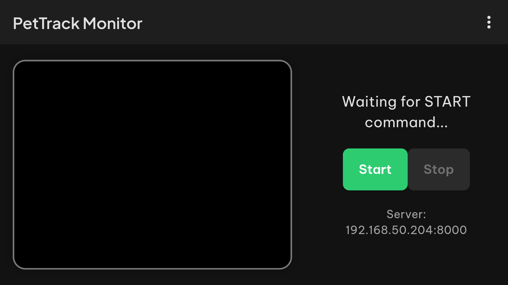
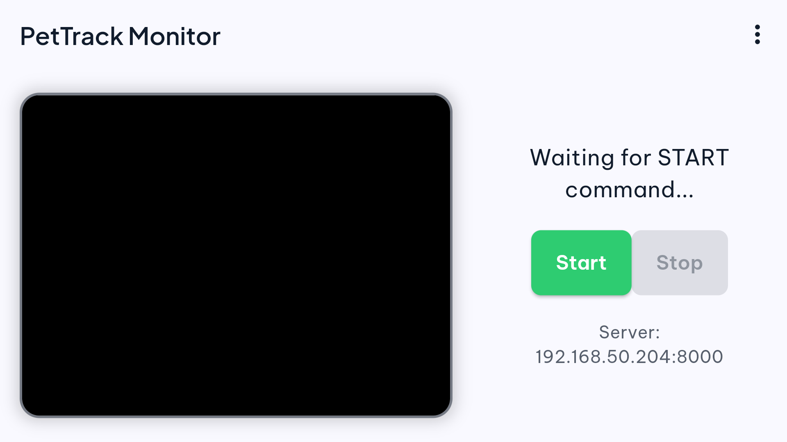
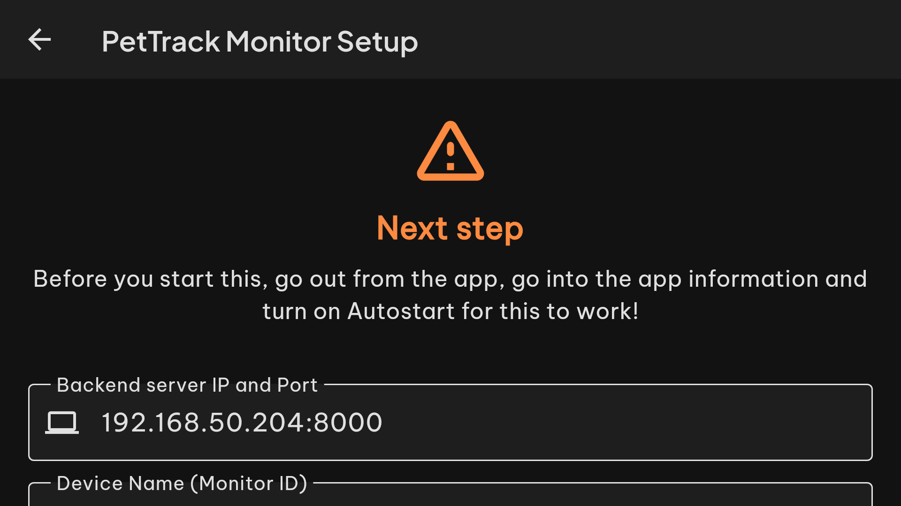
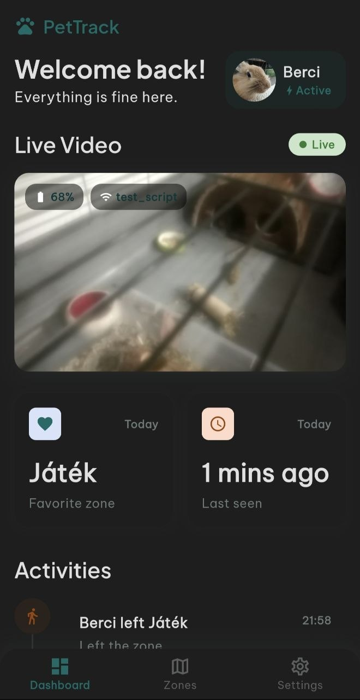
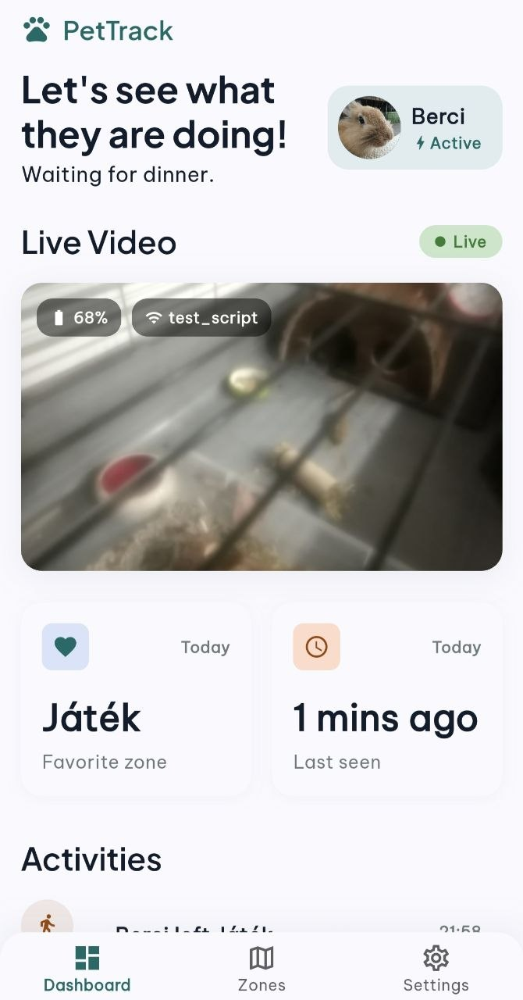
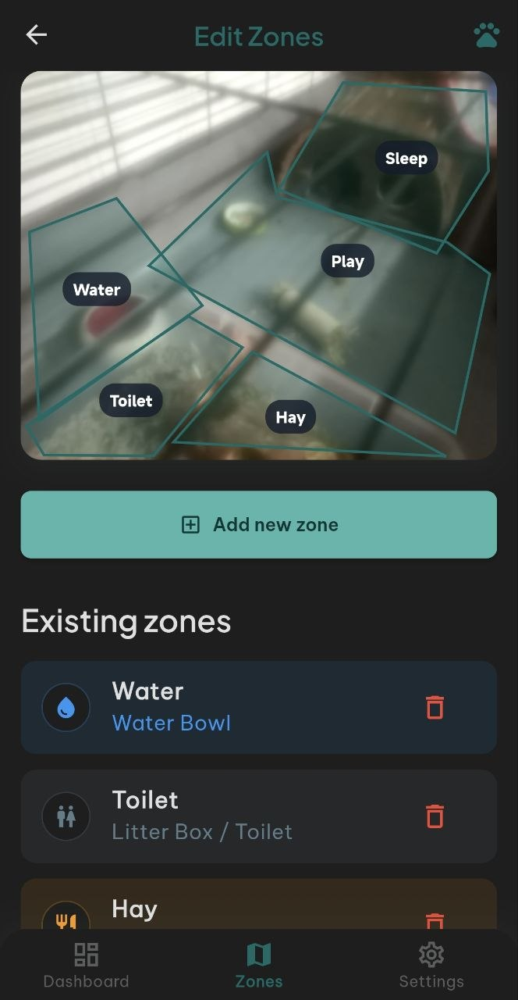

<p align="center">
    
</p>

<h1 align="center">PetTrack</h1>

<p align="center">
    <strong>Trun your dusty old phone into a lightweight surveillance system for your small pets.</strong>
</p>

<p align="center">
    
    
    
    
    <a href="https://github.com/szbnce/stargazers"></a>
</p>

<p align="center">
    <a href="#-the-shiny-visuals">Screenshots</a>
    <a href="#-project-phases">Project Phases</a>
    <a href="#-features">Features</a>
    <a href="#-quick-start">Quick Start</a>
</p>

---

## 🚀 Why PetTrack?

Why buy an expensive, cloud-locked pet camera when you already have the hardware? **PetTrack** breathes new life into your old Android phones by turning them into a dedicated, self-hosted monitor system for your pets.

- 🔒 **Own your data** - Everything goes through your own backend, no external clouds.
- ♻️ **Upcycle hardware** - Put that old Android 7+ phone in your drawer to good use.
- 🔋 **Battery and Thermal Aware** - Built-in telemetry ensures your old phone stays safe while streaming.

---

# 🏗️ Project Phases

This project just started out, there isn't a magical all-in-one working app *yet*. Development is broken into these phases:

* 🟢 **Phase 1: The Monitor (HW/Data Collection) — *Finished***  
  The goal is to get the old phone's camera reliably to the server. Includes WakeLock, battery monitoring, and auto-reconnects.
* 🟡 **Phase 2: The Backend (The Brain) — *In Progress***
  Once the data is being sent reliably, we use server-side logic to process it. This will be shoved into a Docker container.
* 🟡 **Phase 3: The Frontend (The Client) - *In Progress***
  This will be the shiny UI used daily on your main phone to see what the furballs are up to.

---
## ✨ Features

<table>
<tr>
<td width="50%" valign="top">

### 📱 Monitor App (The Camera)
- **Live Video Streaming** (MJPEG) via WebSocket
- **Resilient Connection**: Auto-reconnects and resumes streaming automatically if the backend drops.
- **Battery & Charging Telemetry**: Kepp an eye on the old phone's health remotely.
- **Sleep mode**: Dims the screen so doesn't light up the room / save OLED Burn-in and power while streaming.
- **Localization & Theming**: Full Dark/Light mode support, English and Hungarian translations out of the box.

</td>
<td width="50%" valign="top">

### Client App (The viewer)
- **Clean UI**: Simple and intuitive interface for easy navigation.
- **Live Feed Access**: Beautiful UI to keep track of your furry friends.
- **Customizeable Zones**: Draw zones on the camera feed for motion detection and alerts.
- **Localization & Theming**: Full Dark/Light mode support, English and Hungarian translations out of the box.

</td>
</tr>
</table>

---

## 📸 The Shiny Visuals

### 📱 Monitor App
<p align="center">
  
  &nbsp; &nbsp;
  
  &nbsp; &nbsp;
  
</p>

### 💻 Client App
<p align="center">
  
  &nbsp; &nbsp;
  
  &nbsp; &nbsp;
  
</p>

---

## 🛠️ Quick Start (The Easy Way)

The easiest way to get started is to use the pre-built apps and Docker image.

### Prerequisites
* A machine running **Docker** and **Docker Compose**
* An old Android Phone (The "Monitor") *(Minimal API requirement is 24, Android 7+)*
* Your main phone (The "Client")

### 1. The Backend
You don't need to configure a complex server. Just clone the repository and let Docker do the heavy lifting:

```bash
git clone https://github.com/szbnce/PetTrack.git
cd PetTrack/pettrack_server

# Copy the environment file and set your credentials
cp .env.example .env

# Build and start the backend
docker-compose up --build -d
```
Your backend is now running!

### 2. The Apps
Go tho the [Releases](https://github.com/szbnce/PetTrack/releases) page and download the latest `.apk` files:
1. Install `PetTrack_Monitor.apk` on your old phone. *(Pro Tip: Enable "Autostart" and disable Battery Optimization in Android settings for a stable 24/7 stream).*
2. Install `PetTrack_Client.apk` on your main Phone.
3. Open both apps, enter your server IP and API Token you set in your `docker-compose.yml`, and you're good to go!

---

## 💻 Build from Scratch (For Developers)

If you want to modify the code or compile the apps yourself, follow these steps.

### Prerequisites
* **Flutter SDK** installed on your development machine
* **Docker** and **Docker Compose**
  
### 1. Clone the repository
```bash
git clone https://github.com/szbnce/PetTrack.git
cd PetTrack
```

### 2. Compile the Apps
Navigate to the app folders and build the APKs:

```bash
# Build the Monitor App
cd pettrack_monitor
flutter pub get
flutter build apk
# The APK will be at build/app/outputs/flutter-apk/app-release.apk

# Build the Client App
cd ../pettrack_client
flutter pub get
flutter build apk
```

### 3. Build and Run the Backend
```bash
cd ../pettrack_server
cp .env.example .env
# Edit .env with your API Token
docker-compose up --build -d
```

---

## ❓ Help

If you have any questions, issues, or suggestions, please open an [Issue](https://github.com/szbnce/PetTrack/issues) or [Discussion](https://github.com/szbnce/PetTrack/discussions) on GitHub.

---

## 📝 License

This project is licensed under the **MIT License**.

---

<p align="center">
  Made with ❤️ by <a href="https://github.com/szbnce">szbnce</a> for Pet's and Pet Owners
</p>
