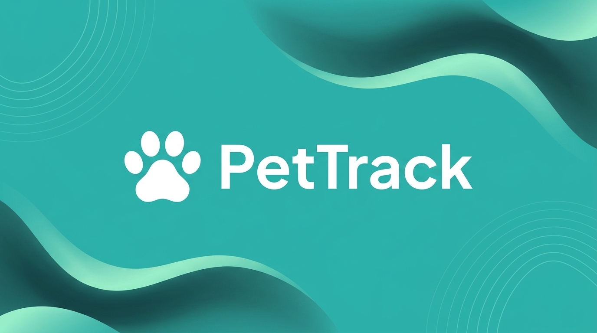
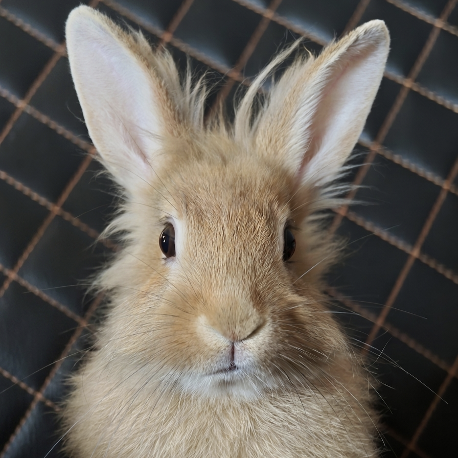
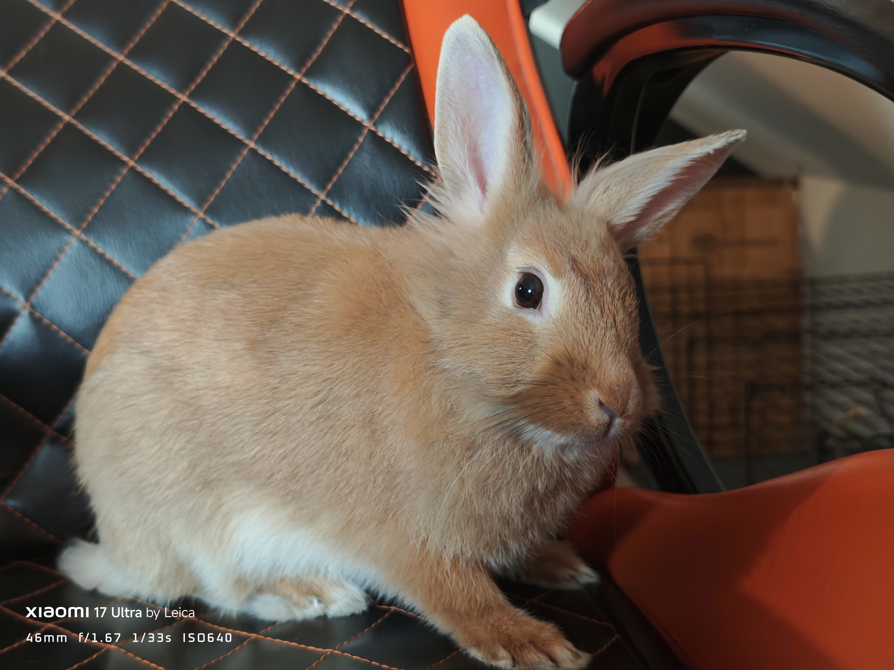
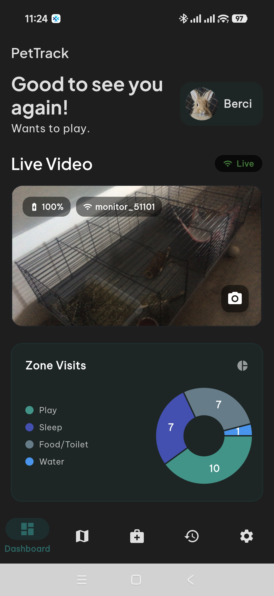
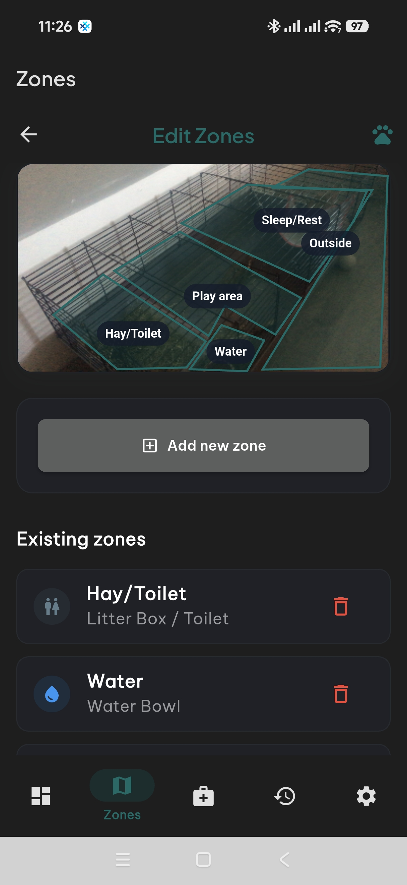
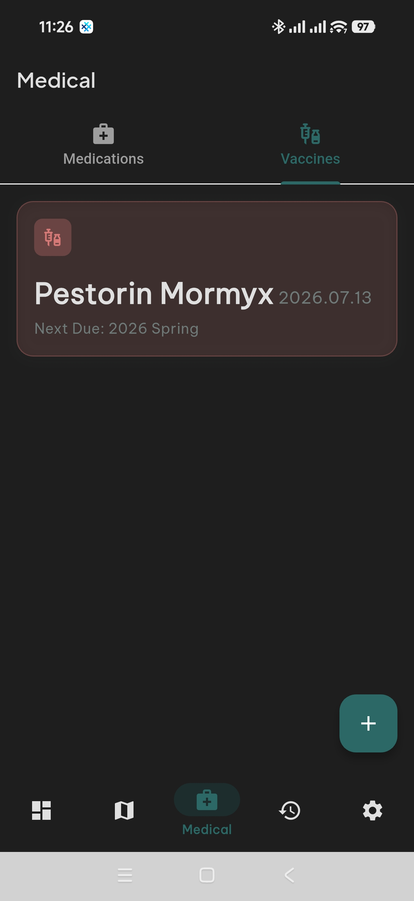
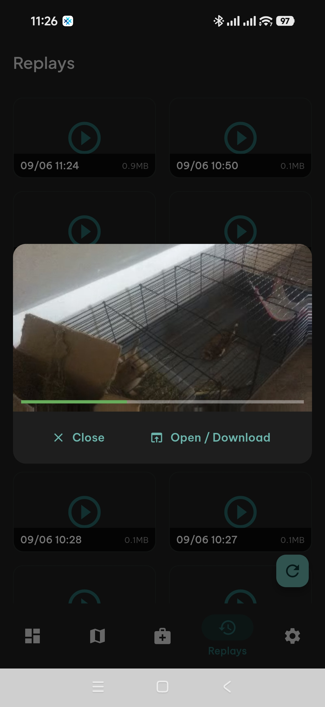
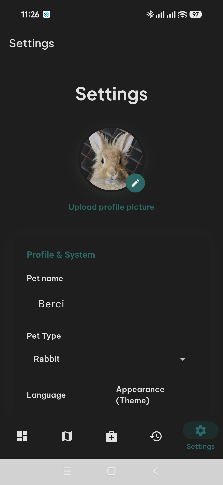

<a id="readme-top"></a>

<!-- PROJECT SHIELDS -->
<!--
*** I'm using markdown "reference style" links for readability.
*** Reference links are enclosed in brackets [ ] instead of parentheses ( ).
*** See the bottom of this document for the declaration of the reference variables
*** for contributors-url, forks-url, etc. This is an optional, concise syntax you may use.
*** https://www.markdownguide.org/basic-syntax/#reference-style-links
-->
[![Contributors][contributors-shield]][contributors-url]
[![Forks][forks-shield]][forks-url]
[![Stargazers][stars-shield]][stars-url]
[![Issues][issues-shield]][issues-url]
[![Unlicense License][license-shield]][license-url]
[![LinkedIn][linkedin-shield]][linkedin-url]


<!-- PROJECT LOGO -->
<br />
<div align="center">
  <a href="https://github.com/szbnce/PetTrack">
    
  </a>

  <h3 align="center">PetTrack</h3>

  <p align="center">
    Your old phone is your new pet monitor!
    <br />
    <a href="https://github.com/othneildrew/Best-README-Template"><strong>Explore the docs »</strong></a>
    <br />
    <br />
    <a href="https://pettrackdemo.szabence.com">Try PetTrack</a>
    &middot;
    <a href="https://github.com/szbnce/PetTrack/issues/new?labels=bug&template=bug-report---.md">Report Bug</a>
    &middot;
    <a href="https://github.com/othneildrew/Best-README-Template/issues/new?labels=enhancement&template=feature-request---.md">Request Feature</a>
  </p>
</div>


<!-- TABLE OF CONTENTS -->
<details>
  <summary>Table of Contents</summary>
  <ol>
    <li>
      <a href="#about-the-project">About The Project</a>
      <ul>
        <li><a href="#built-with">Built With</a></li>
      </ul>
    </li>
    <li>
      <a href="#getting-started">Getting Started</a>
      <ul>
        <li><a href="#prerequisites">Prerequisites</a></li>
        <li><a href="#installation">Installation</a></li>
      </ul>
    </li>
    <li><a href="#contributing">Contributing</a></li>
    <li><a href="#privacy-policy">Privacy Policy</a></li>
    <li><a href="#license">License</a></li>
    <li><a href="#contact">Contact</a></li>
    <li><a href="#acknowledgments">Acknowledgments</a></li>
  </ol>
</details>


<!-- ABOUT THE PROJECT -->
## About The Project

In may of 2026, my brother got a rabbit as a gift for her goddaughter, but her mother wasn't very pleased and threw a tantrum, so he had to took the rabbit, and I took her in, her name is Berci, a lionhead dwarf rabbit, she is around 7-8 months old as I am writing this README.

<div align="center">
  
  
  
</div>

She is a very active and curious rabbit, and always finding loopholes around stuff, so when I was in school and working, I had no idea what she was up to, so I started searching for pet cameras, but they are expensive, sometimes even a paid subscription model, and I had lot's of phones laying around, with perfectly good cameras, WiFi, so I thought, why couldn't I make an IP-cam from those, and use that? I tried it, it worked, but it was not great. I mean, who would want to look at their beloved pets though an ugly, and not very user friendly application that was sometimes buggy, unstable? This is how PetTrack was born:

<div align="center">
  
  
  
  
  
</div>

PetTrack is a lightweight Pet monitor that upcycles old phones, and uses them as Pet Monitors that you can put near their cage, and check up on them when you are not home, and more. 

<p align="right">(<a href="#readme-top">back to top</a>)</p>

## Features

* Live video Stream
* Take picture and send instantly
* Set name, pet type, profile picture
* Zone setting and pet tracking
* Movement recordings that are replayable instantly and shareable
* Activity log
* Vaccine and Medication tracking
* Android / iOS / Web / WearOS Support

<p align="right">(<a href="#readme-top">back to top</a>)</p>


### Built With

* [![Flutter][Flutter.dev]][Flutter-url]
* [![Dart][Dart.dev]][Dart-url]
* [![FastAPI][FastAPI.tiangolo]][FastAPI-url]
* [![Python][Python.org]][Python-url]
* [![OpenCV][OpenCV.org]][OpenCV-url]
* [![SQLite][SQLite.org]][SQLite-url]

<p align="right">(<a href="#readme-top">back to top</a>)</p>


<!-- GETTING STARTED -->
## Getting Started

### Prerequisites

* An old phone (Android 7+ / iPhone 6s+)
* A PC/Server (Anything that is capable of running Docker, but there are scripts to run natively, outside docker)
* [A DDNS service](https://www.noip.com) (optional)

### Installation
Docker:

1. Clone the repo
   ```sh
   git clone https://github.com/szbnce/PetTrack.git
   ```
2. Install  packages
   ```sh
   docker compose up -d --build pettrack
   ```
3. Check the logs for the 4 number PIN to access server
   ```bash
   docker logs pettrack
   ```
Your server should be reachable from the web at `http://<server_ip>:8000` (Both server and Web interface).

Natively (Linux, Windows, MacOS):

1. Clone the repo
   ```
   git clone https://github.com/szbnce/PetTrack.git
   ```
2. Install  packages
   ```
   ./install_linux.sh / ./install_macos.sh / install_windows.bat
   ```
3. Run the server
   ```
   ./run_linux_and_macos.sh / run_windows.bat
   ```

### Now, the phone app:
On phones, you can either use the Web interface and put a shortcut to it on your home screen or you can sideload the app to use natively.

Android:

1. Download the APK from the [Releases page](https://github.com/szbnce/PetTrack/releases) on Github.
2. Enable "Install from unknown sources" in your Android settings.
3. Install the APK.
4. Open the app, select your language, select if you want to use it as a Monitor or Client, then enter the IP and Port (On the Monitor phone, you should use the local IP, not the external IP, on the Client you should use the external IP, if DDNS is set up, or Tailscale.)

iOS:

1. Download the .iPA file from the [Releases page](https://github.com/szbnce/PetTrack/releases) on Github.
2. Use a tool like [Sideloadly](https://sideloadly.io/) to install the .iPA file to your iOS device.
    - Note that you will have to allow the developer account in the device management settings, and you will have to re-authorize the app every 7 days.
3. Open the app, select your language, select if you want to use it as a Monitor or Client, then enter the IP and Port (On the Monitor phone, you should use the local IP, not the external IP, on the Client you should use the external IP, if DDNS is set up, or Tailscale.)

Web:

1. Open the [Web interface](https://pettrackdemo.szabence.com)
2. Select your language, select if you want to use it as a Monitor or Client, then enter the IP and Port (On the Monitor phone, you should use the local IP, not the external IP, on the Client you should use the external IP, if DDNS is set up, or Tailscale.)

WearOS:

1. Download the .APK
2. Turn on Wi-Fi
3. Turn on Developer settings
4. Turn on ADB debugging
5. Connect the watch to your PC and authorize the ADB connection
6. Open a terminal and run: `adb install <path_to_apk>`
7. Open the app on the watch and paired phone
8. In settings, scroll to the bottom, there is a Sync watch button, press it, and it will now work on the watch!

<p align="right">(<a href="#readme-top">back to top</a>)</p>


<!-- CONTRIBUTING -->
## Contributing

Contributions are what make the open source community such an amazing place to learn, inspire, and create. Any contributions you make are **greatly appreciated**.

If you have a suggestion that would make this better, please fork the repo and create a pull request. You can also simply open an issue with the tag "enhancement".
Don't forget to give the project a star! Thanks again!

1. Fork the Project
2. Create your Feature Branch (`git checkout -b feature/AmazingFeature`)
3. Commit your Changes (`git commit -m 'Add some AmazingFeature'`)
4. Push to the Branch (`git push origin feature/AmazingFeature`)
5. Open a Pull Request

### Top contributors:

<a href="https://github.com/szbnce/pettrack/graphs/contributors">
  
</a>

<p align="right">(<a href="#readme-top">back to top</a>)</p>


<!-- AI USAGE DECLARATION -->
## AI Usage Declaration

This project was developed with the assistance of Artificial Intelligence (AI) coding assistants. AI was used to help accelerate the development process by generating boilerplate code, assisting with UI layouts, brainstorming solutions, and helping write documentation.

While AI tools were utilized, the core architecture, design decisions, and ultimate responsibility for the codebase remain with the human author.

<p align="right">(<a href="#readme-top">back to top</a>)</p>


<!-- PRIVACY POLICY -->
## Privacy Policy

You can read the Privacy Policy for PetTrack by referring to the [`PRIVACY_POLICY.md`](PRIVACY_POLICY.md) file.

<p align="right">(<a href="#readme-top">back to top</a>)</p>


<!-- LICENSE -->
## License

Distributed under the GNU License. To read more, please refer to the `LICENSE` file.

<p align="right">(<a href="#readme-top">back to top</a>)</p>


<!-- CONTACT -->
## Contact

Bence Szabó - [@szbnce](https://t.me/szbnce) - contact@szabence.com

Project Link: [https://github.com/szbnce/pettrack](https://github.com/szbnce/pettrack)

<p align="right">(<a href="#readme-top">back to top</a>)</p>


<!-- ACKNOWLEDGMENTS -->
## Acknowledgments

* [Stardance](https://stardance.hackclub.com)
* [Img Shields](https://shields.io)
* [Best-README-template](https://github.com/othneildrew/Best-README-Template)

<p align="right">(<a href="#readme-top">back to top</a>)</p>


<!-- MARKDOWN LINKS & IMAGES -->
<!-- https://www.markdownguide.org/basic-syntax/#reference-style-links -->
[contributors-shield]: https://img.shields.io/github/contributors/szbnce/pettrack.svg?style=for-the-badge
[contributors-url]: https://github.com/szbnce/pettrack/graphs/contributors
[forks-shield]: https://img.shields.io/github/forks/szbnce/pettrack.svg?style=for-the-badge
[forks-url]: https://github.com/szbnce/pettrack/network/members
[stars-shield]: https://img.shields.io/github/stars/szbnce/pettrack.svg?style=for-the-badge
[stars-url]: https://github.com/szbnce/pettrack/stargazers
[issues-shield]: https://img.shields.io/github/issues/szbnce/pettrack.svg?style=for-the-badge
[issues-url]: https://github.com/szbnce/pettrack/issues
[license-shield]: https://img.shields.io/github/license/szbnce/pettrack.svg?style=for-the-badge
[license-url]: https://github.com/szbnce/pettrack/blob/master/LICENSE
[linkedin-shield]: https://img.shields.io/badge/-LinkedIn-black.svg?style=for-the-badge&logo=linkedin&colorB=555
[linkedin-url]: https://linkedin.com/in/szbnce
[product-screenshot]: images/screenshot.png
[Flutter.dev]: https://img.shields.io/badge/Flutter-02569B?style=for-the-badge&logo=flutter&logoColor=white
[Flutter-url]: https://flutter.dev/
[Dart.dev]: https://img.shields.io/badge/Dart-0175C2?style=for-the-badge&logo=dart&logoColor=white
[Dart-url]: https://dart.dev/
[FastAPI.tiangolo]: https://img.shields.io/badge/FastAPI-009688?style=for-the-badge&logo=fastapi&logoColor=white
[FastAPI-url]: https://fastapi.tiangolo.com/
[Python.org]: https://img.shields.io/badge/Python-3776AB?style=for-the-badge&logo=python&logoColor=white
[Python-url]: https://python.org/
[OpenCV.org]: https://img.shields.io/badge/OpenCV-5C3EE8?style=for-the-badge&logo=opencv&logoColor=white
[OpenCV-url]: https://opencv.org/
[SQLite.org]: https://img.shields.io/badge/SQLite-003B57?style=for-the-badge&logo=sqlite&logoColor=white
[SQLite-url]: https://sqlite.org/ 